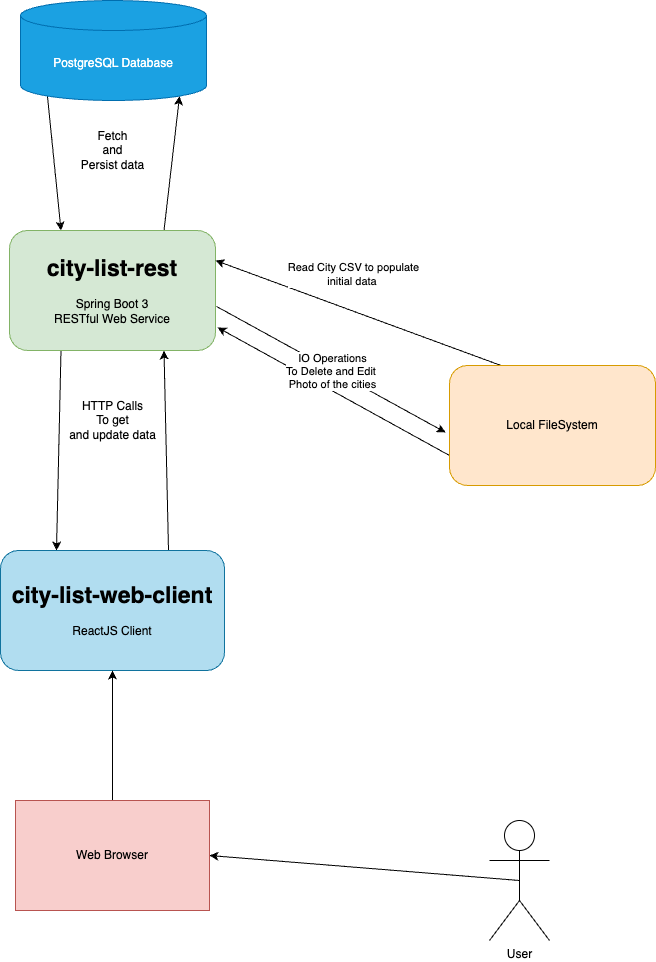

[README](./README.md)
1. [Quick Start](./quick-start.md)
2. [Big Picture](./big-picture.md)
3. [Authentication & Authorization](./auth.md)
4. [Extra](./quick-start.md)

----

# The Big Picture
The project consists of the following modules;
1. PostgreSQL Database
2. Spring Boot RESTful Webservice
3. ReactJS Client

See more on the following diagram; \

