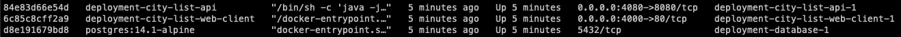
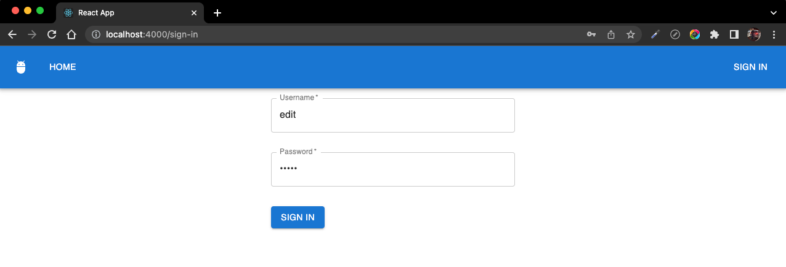
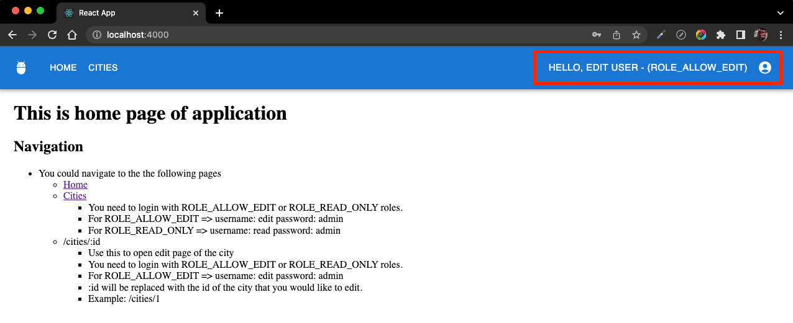
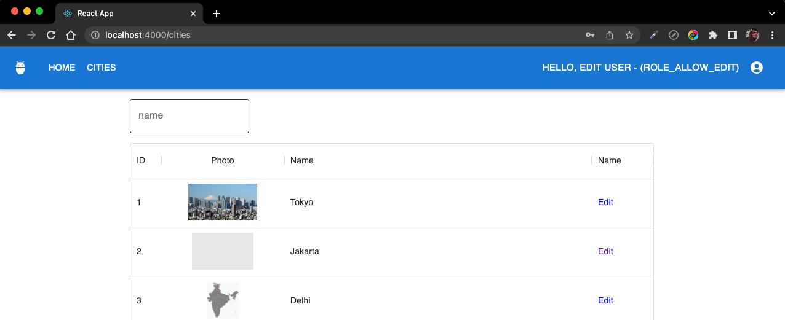
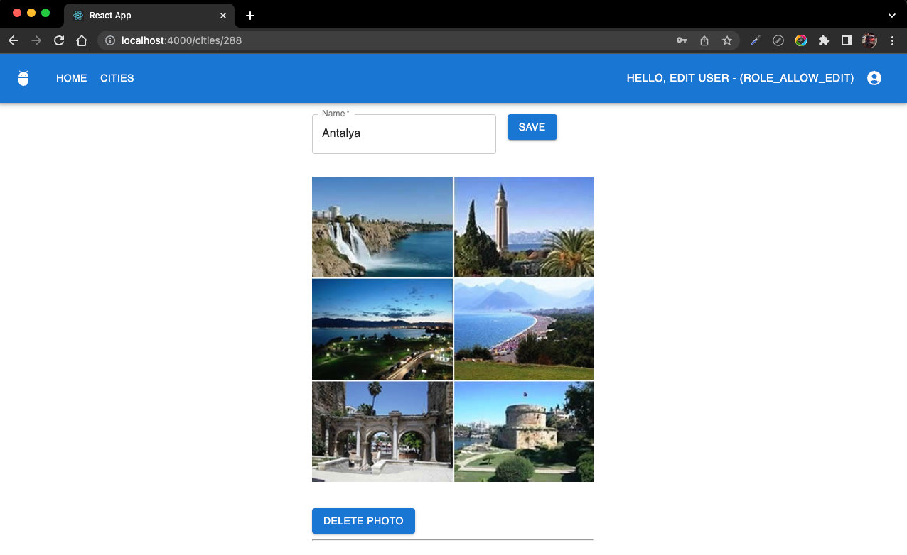
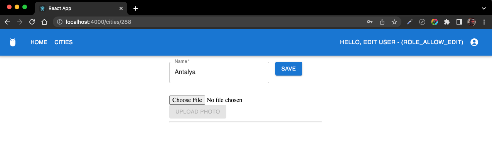

[README](./README.md)
1. [Quick Start](./quick-start.md)
2. [Big Picture](./big-picture.md)
3. [Authentication & Authorization](./auth.md)
4. [Extra](./extra.md)

--- 

# Quick Start
**Pre-requisites**
- deployment scripts are based on docker-compose.
- Docker Environment should be installed
- Also docker-compose is a must

## Deployment
All the deployment related files are placed under deployment (see [deployment](./deployment)) folder under the repo.

Clone project to your local

To bootstrap app run the following command
```shell
docker-compose -f /path/to/repo/deployment/docker-compose.yml --env-file /path/to/repo/deployment/.env up -d
```
It may take ~4mins minutes to wake-up. \
You could follow the process with the following command
````shell
docker-compose -f /path/to/repo/deployment/docker-compose.yml --env-file /path/to/repo/deployment/.env up -d
````
See more on the following diagram; \
[Deployment Life-Cycle](./documentation/deployment-life-cycle-v1.png)

After build operation completed, backend module will start populating cities from CSV file (see [cities.csv](./city-list-api/city-list-rest/src/main/resources/data/cities.csv)). \
Meanwhile, you can start using application.

You can check running containers. It should be similar to something following; \


Open browser and open http://localhost:4000/sign-in


After sign in you will be redirected to home page
As you can see on the screenshot at app bar, full name and role of the user are visible. \
For example in this screenshot, our user's full name is **EDIT USER** and it has **ROLE_ALLOW_EDIT**


## Listing Cities
To list cities navigate to /cities path. A page on the following screenshot will be shown to the user \
From top-left of the table, cities may search with name and \
by clicking **Edit**, user will be redirected to edit City screen



## Editing Cities
If the city has photo; name and photo of the city will shown to the user as follows; \
By updating name field and clicking **Save** button, city name updated. \


By clicking **Delete Photo** photo of the city will be deleted. \
After selecting file with file picker, by clicking **Upload Photo** button \ 
photo for the city will be saved and related with city. \
and screen will become similar to the previous screen shot


### IMPORTANT NOTE 1
Environment variables at .env (see [.env](./deployment/.env)) are important. Host and Port values for backend and front-end modules are stored at this variable.

### IMPORTANT NOTE 2
If you change the values then you the see the affects of your change you shuld build images by running the following command
````bash
 docker-compose -f /path/to/repo/deployment/docker-compose.yml build --no-cache
````
